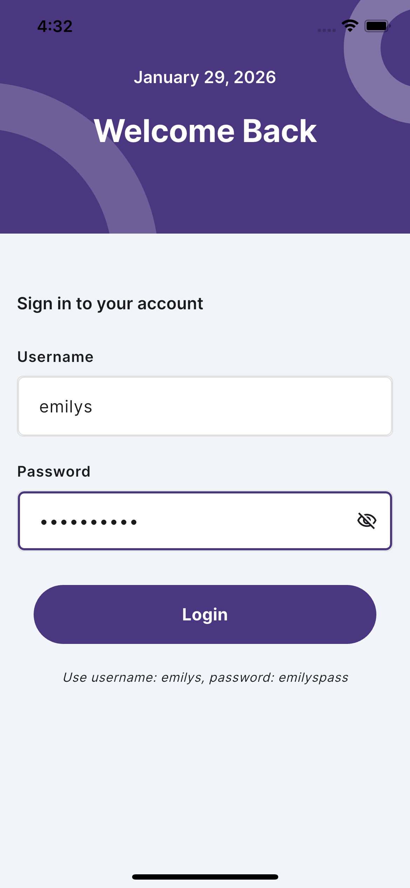
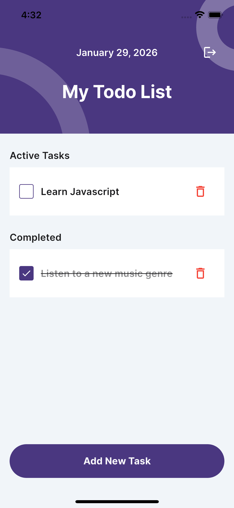
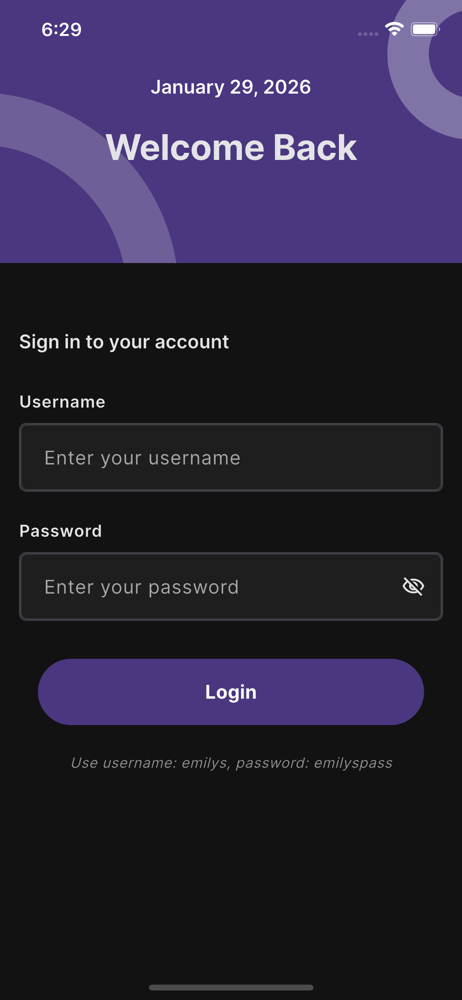
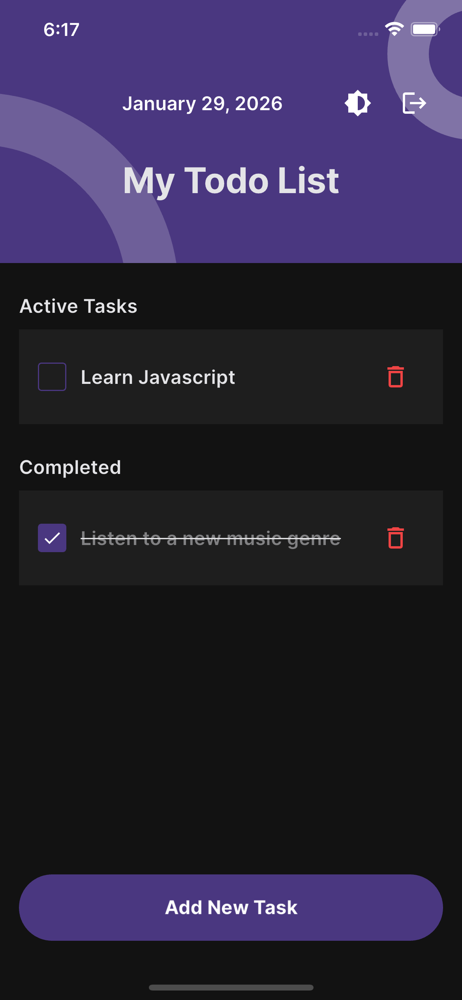
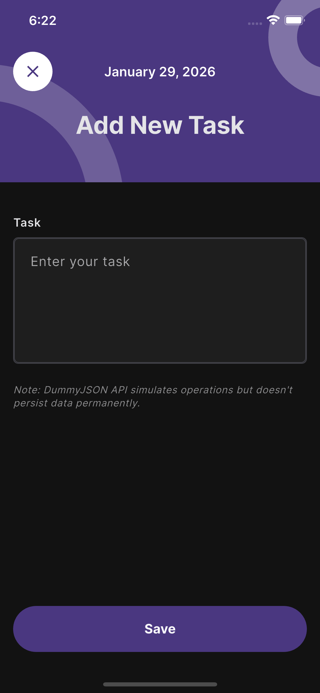

# Task Manager App - Flutter Technical Assessment

A well-architected task management application built with Flutter, following Clean Architecture principles and modern development practices.

## Features

- ✅ User Authentication (Login with DummyJSON API)
- ✅ Task Management (View, Add, Edit, Delete)
- ✅ Pagination for efficient data loading
- ✅ Secure session persistence
- ✅ Local caching for offline access
- ✅ Dark mode support with theme persistence
- ✅ Clean Architecture implementation
- ✅ State management with Bloc/Cubit
- ✅ Protected routing with GoRouter

## Screenshots

### Light Mode
<p float="left">
  
  
  
</p>

### Dark Mode
<p float="left">
  
  
  
</p>

## Project Setup

### Prerequisites

- Flutter SDK (3.10.1 or higher)
- Dart SDK
- IDE (VS Code or Android Studio)

### Installation

1. Clone the repository:
```bash
git clone <repository-url>
cd todo_app
```

2. Install dependencies:
```bash
flutter pub get
```

3. Generate mapper files for dart_mappable:
```bash
dart run build_runner build --delete-conflicting-outputs
```

4. Run the app:
```bash
flutter run
```

### Test Credentials

Use the following credentials to log in:
- **Username**: `emilys`
- **Password**: `emilyspass`

## Project Structure

The project follows Clean Architecture principles with clear separation of concerns:

```
lib/
├── core/                      # Shared/core functionality
│   ├── data/
│   │   ├── models/           # Shared models (PaginatedResponse)
│   │   └── repositories/     # Base repository with error handling
│   ├── network/              # Network layer
│   │   ├── network_provider.dart    # Dio HTTP client
│   │   ├── endpoints.dart           # API endpoints
│   │   └── error/                   # Error handling
│   └── session/
│       └── session_manager.dart     # Session state management
│
├── features/                  # Feature modules
│   ├── authentication/        # Auth feature
│   │   ├── data/             # Data layer
│   │   │   ├── datasources/  # Remote & Local data sources
│   │   │   ├── models/       # Data models
│   │   │   └── repositories/ # Repository implementation
│   │   ├── domain/           # Domain layer
│   │   │   └── repositories/ # Repository interface
│   │   └── presentation/     # Presentation layer
│   │       ├── bloc/         # State management
│   │       └── views/        # UI screens
│   │
│   ├── settings/             # Settings feature
│   │   ├── data/             # Theme preferences
│   │   └── presentation/     # Theme management
│   │
│   └── todos/                # Todos feature
│       ├── data/
│       ├── domain/
│       └── presentation/
│
├── global/                    # App-wide resources
│   ├── routes/               # Routing configuration
│   └── theme/                # Theme and styling
│
└── main.dart                 # App entry point & DI setup
```

## Architecture & Technical Decisions

**Clean Architecture** with three layers: Domain (business logic), Data (API + Cache), and Presentation (UI + State Management).

### Key Technical Choices

1. **BLoC/Cubit Pattern** - Predictable state management with clear separation of concerns
   - `AuthenticationBloc` - Manages login, logout, and session persistence
   - `TodosBloc` - Handles CRUD operations and pagination with optimistic updates
   - `ThemeCubit` - Lightweight state management for theme switching

2. **Repository Pattern with Either** - Functional error handling using fpdart's Either type
   - Forces explicit error handling at every layer
   - No silent failures, all errors handled at compile time

3. **Offline-First Strategy** - Separate remote and local data sources
   - Repository coordinates between network and cache
   - Error states can include cached data for graceful degradation

4. **GoRouter** - Type-safe navigation with authentication guards and protected routes

5. **Pagination** - Cumulative loading with scroll position preservation using PaginatedResponseModel

## Testing

**76 comprehensive tests** across all layers following best practices with fixture-based testing, Mocktail for mocking, and bloc_test utilities.

### Running Tests

```bash
flutter test                              # Run all tests
flutter test test/features/todos/        # Todo feature only
flutter test test/features/authentication/  # Auth feature only
flutter test --coverage                   # With coverage report
```

### Test Coverage
- **Authentication (41 tests)**: Data sources, repositories, and BLoC state transitions
- **Todos (35 tests)**: CRUD operations, pagination, and error handling

## Key Implementation Highlights

### Dark Mode System
Complete theme implementation with light, dark, and system modes. Theme preference persists across app restarts using local storage. All UI colors use theme-based values for automatic adaptation.

### Pagination & State Management
Cumulative data loading that preserves scroll position. Separate loading states (initial, loading more, operations) prevent unnecessary list refreshes during CRUD operations.

### Error Handling & Offline Support
Either pattern enforces explicit error handling at every layer. App works offline with cached data fallback. Error states gracefully degrade with cached information when network fails.

### Testing Strategy
Fixture-based approach with JSON test data. Type-safe mocking using Mocktail with Fake implementations. All tests follow Arrange-Act-Assert pattern for consistency.

## Dependencies

**Core**: flutter_bloc, go_router, fpdart • **Network**: dio, flutter_secure_storage, shared_preferences • **Serialization**: dart_mappable • **Testing**: bloc_test, mocktail

## Code Quality & Best Practices

- Clean Architecture with clear layer separation
- SOLID principles and DRY code
- Type-safe error handling with Either pattern
- 76 comprehensive unit tests with fixture-based approach
- Extensive use of const constructors for performance
- Null safety throughout the codebase

## Notes

**DummyJSON API**: Simulates backend operations but doesn't persist data permanently. All CRUD operations return realistic responses for testing purposes.

**Future Enhancements**: Integration & widget tests • CI/CD pipeline • Accessibility improvements • Internationalization

---

**Architecture**: Clean Architecture • **State Management**: BLoC/Cubit • **Framework**: Flutter 3.10.1+ • **Tests**: 76